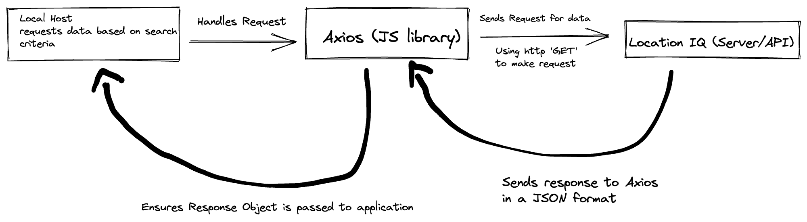
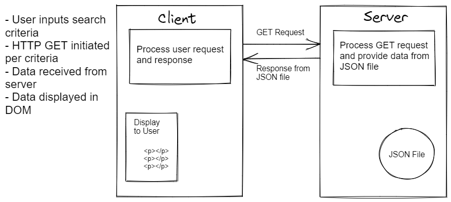
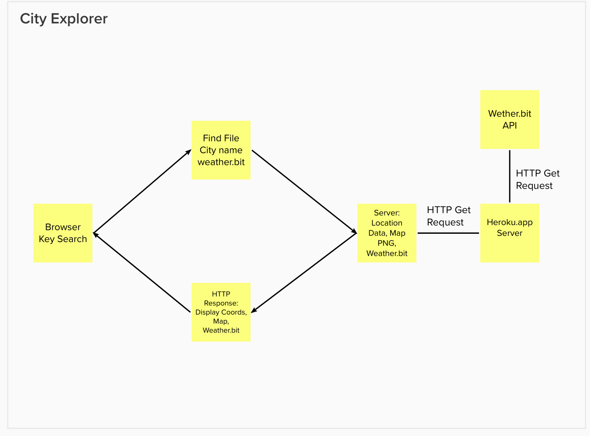

# City Explorer

**Author**: Chris Fanucchi
**Version**: 1.4.1

## Overview

A website for displaying city information based on user input.

## Getting Started

This app can be copied and used locally, but requires a LocationIQ token key for use.

## Architecture

This app uses JavaScript, React, Axios and API calls to Location IQ.

## Change Log

09-26-2022 14:30 - Setup initial files and file structure for app.

## Credit and Collaborations

Worked with Mehtab Riar, Erik Dobb, and Ian Forrester on http request cycle process diagrams.

## Feature Addition Tracking

1. Name of feature: Initial setup and code to access APIs
   Estimate of time needed to complete: 2.5 hours
   Start time: 14:30
   Finish time: 17:30
   Actual time needed to complete: 3 hours

2. Name of feature: Add weather to page
   Estimate of time needed to complete: 1 hour
   Start time: 17:30
   Finish time: 19:00
   Actual time needed to complete: 1.5 hours

3. Name of feature: Reconfigure weather display for new data
   Estimate of time needed to complete: 1.5 hour
   Start time: 17:00
   Finish time: 18:30
   Actual time needed to complete: 1.5 hours

4. Name of feature: Componentize weather and movies displays
   Estimate of time needed to complete: 0.5
   Start time: 13:15
   Finish time: 18:40
   Actual time needed to complete: ~0.5 hours
